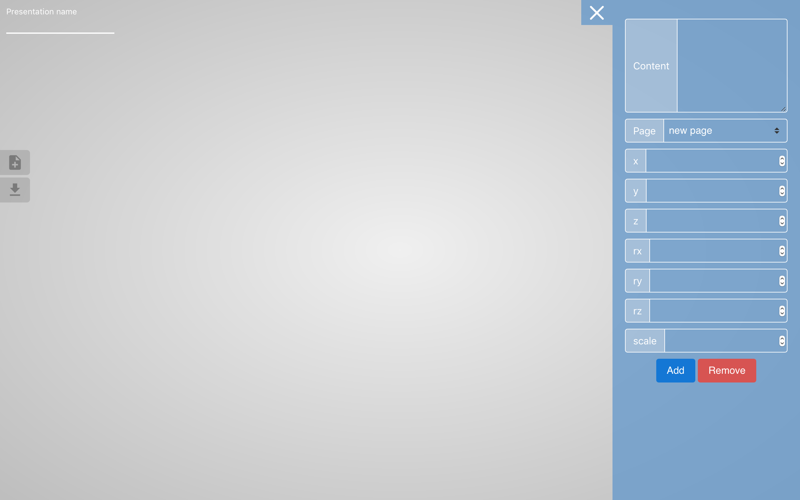
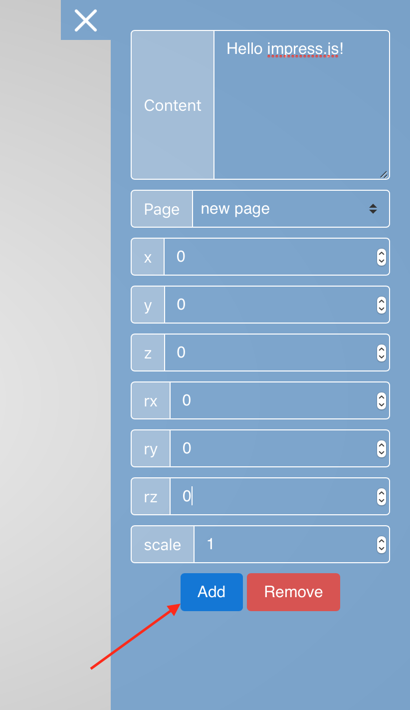
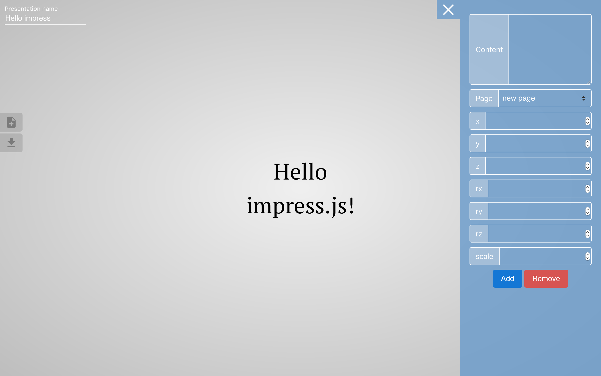
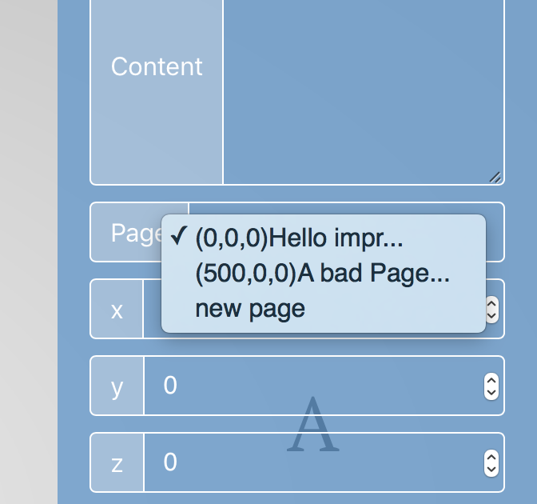
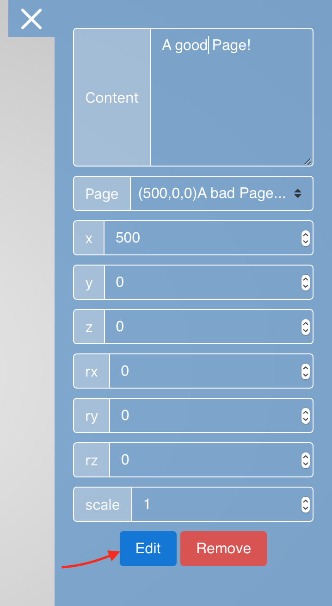
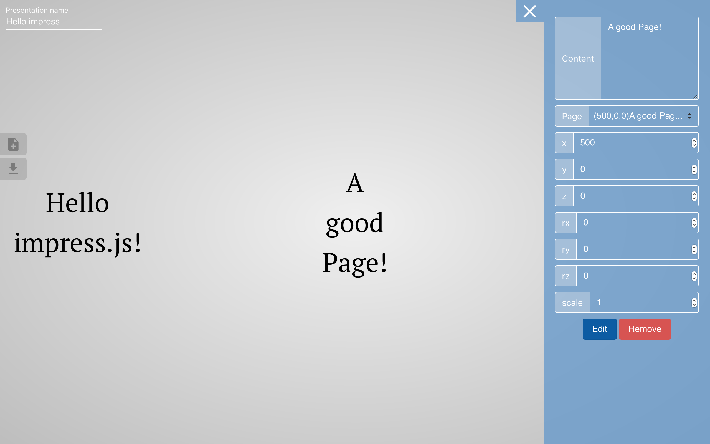
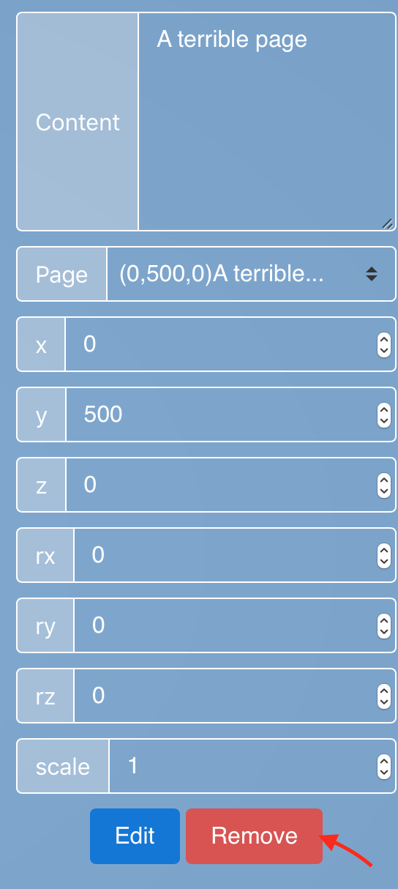

# impress.js presentation generator
A website to generate [impress.js](https://github.com/impress/impress.js) presentation pages easily.
## How to use
It is very easy to use this generator.  
1. Visit the website.
You'll see this page.

2. Edit the presentation name to change your presentation name.

3. To add a page, edit the page information control panel at right.

And click Add.You'll see the page.

4. You can switch pages by using the select.

5. After switch to the page, you can edit the page.

And click Edit.You'll see the edited page.

6. If you are not satisfied with a page, just switch to it and remove it.

